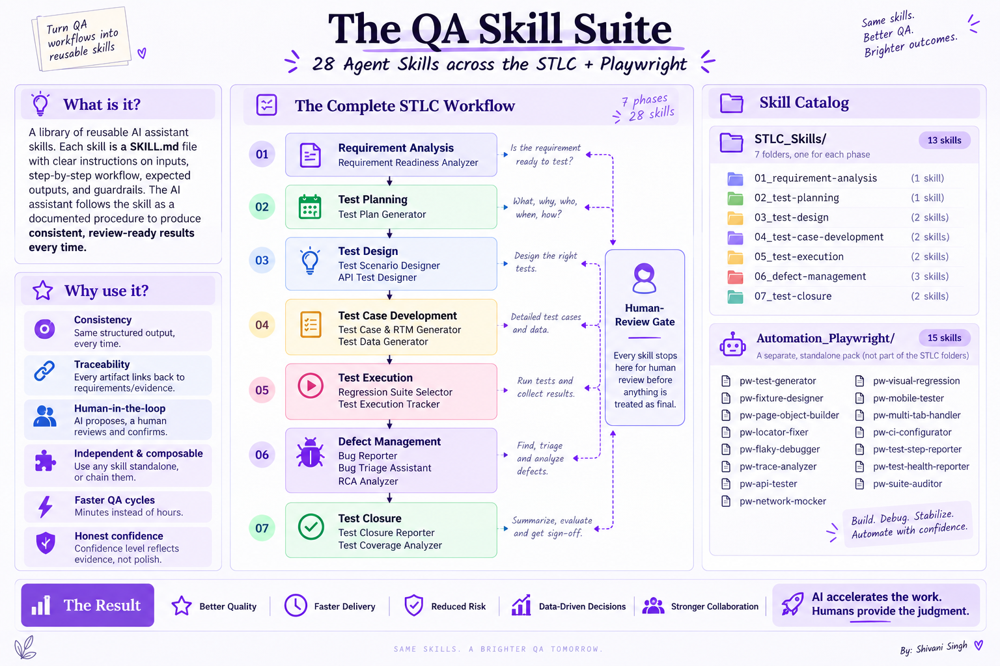

# QA Skill Library — STLC Skills for AI Coding Assistants



**🔗 Browse it live: [qa-skill-library.vercel.app](https://qa-skill-library.vercel.app)**

A library of reusable **AI assistant skills** that cover the Software Testing Life Cycle (STLC) end to end — from judging whether a requirement is ready to test, through planning, design, test case authoring, defect management, and test closure. Each skill is a single `SKILL.md` file: a self-contained set of instructions that tells the AI assistant exactly how to perform one QA activity, consistently, every time.

## Who Is This For?

- **QA Engineers** — run any skill end-to-end, from readiness checks through closure reports.
- **SDETs / Automation Engineers** — take an approved scenario or test case straight into the Playwright Automation Pack.
- **Test Leads** — triage backlogs, run RCAs, and produce closure reports for sign-off.
- **Business Analysts** — pressure-test requirements for gaps and ambiguity before they reach development.
- **Product Owners** — use requirement-readiness and test-planning output to validate scope before committing to a sprint.

## Complete STLC Workflow

This library provides reusable AI assistant skills across the **entire Software Testing Life Cycle** — requirement analysis through closure, not just test design or automation:

```
 Requirement Analysis
         │
         ▼
    Test Planning
         │
         ▼
     Test Design
         │
         ▼
Test Case Development
         │
    ┌────┴─────┐
    ▼          ▼
Test Data   Playwright Automation
    │          │
    └────┬─────┘
         ▼
  Test Execution
         │
         ▼
 Defect Management
         │
         ▼
Root Cause Analysis
         │
         ▼
Test Coverage Analysis
         │
         ▼
   Test Closure
```

Every box above is backed by one or more reusable AI assistant skills — see **Skill Catalog** below.

Skills are **independent**: any box can be run on its own. Previous outputs are **reused when available** (e.g., a Test Plan reuses an existing Readiness Assessment) — but no hand-off is required to get value from a single skill.

## What Is Done, and Why

Manually re-explaining "how we do requirement analysis" or "how we triage bugs" to an AI assistant every time is slow and inconsistent — one session's format won't match the next, and important guardrails (never invent an acceptance criterion, never auto-close a bug, always stop for human sign-off) can quietly get skipped. This library fixes that by encoding each QA activity **once**, as a skill, so that:

- The same request ("is this ticket ready to test?") produces the same structured, review-ready output every time, from anyone on the team.
- Every skill is scoped to **one responsibility** (e.g., Test Scenario Designer decides *what* to test, never *how* — that's the Playwright Automation Pack's job) so outputs stay predictable and skills can be chained safely.
- Every skill treats its output as a **draft for a human to confirm**, never a final decision — nothing gets written back to Jira, closed, merged, or shipped by the skill itself.

## What Is a "Skill"?

A skill is a Markdown file (`SKILL.md`) with a short YAML header (name, description, version) followed by structured instructions: what inputs it accepts, what workflow it follows step by step, what its output must contain, and what it must never do (its **guardrails**). A compatible AI assistant reads the skill file and follows it in place of general-purpose reasoning — the same way a new teammate would follow a documented procedure instead of improvising.

You invoke a skill by pointing your AI assistant at its `SKILL.md` path (or describing your task the way its `description` trigger expects — see the **Example Prompt** column in the **Skill Catalog** below) and telling it what to produce.

## Why Use a Skill (Benefits)

| Benefit | What It Means in Practice |
|---|---|
| **Consistency** | Every readiness assessment, test plan, or bug report follows the same sections and terminology, regardless of who asked for it. |
| **Traceability** | Every finding, scenario, or test case must trace back to a stated requirement, AC, or piece of evidence — nothing is invented to fill a gap. |
| **Human-in-the-loop by design** | Every skill ends in a mandatory **Human Review Gate** (Facts / Observations / Assumptions / Unknowns) — the assistant proposes, a person confirms. |
| **Independent & composable** | Every skill works standalone — you can jump straight to Test Case & RTM Generator without ever running the earlier skills. When an upstream output *is* available, downstream skills reuse it instead of re-deriving it — but reuse is optional, never required. |
| **Faster QA cycles** | Turns a Jira ticket ID into a structured, review-ready draft (readiness score, test plan, scenarios, RTM, bug report, RCA, closure report) in minutes instead of a manual write-up. |
| **Confidence is honest, not inflated** | Every skill states a Confidence Level (High/Medium/Low) tied to how complete the evidence actually was — never to how long the report is. |

## Prerequisites

- **An AI coding assistant that supports skill files** (e.g. Claude Code, GitHub Copilot, or another compatible agent/CLI) — the environment that reads and executes these `SKILL.md` files.
- **This skill library available locally** — cloned or present in your workspace (e.g. this `SKILL_CATALOG`).
- **Optional — Jira or Azure DevOps access** — only needed if you want a skill to retrieve a requirement or defect directly by ID instead of pasting text.
- **Optional — an MCP integration** (e.g. Atlassian/Rovo) configured in your AI assistant — enables direct Jira/ADO retrieval above, and lets Bug Reporter automatically check Jira for an existing/duplicate defect before you file a new one.
- **Optional — a Playwright project** — only needed if you intend to run the drafts produced by the Playwright Automation Pack.

## Library Structure

Skills are grouped into folders numbered by STLC phase, alongside a separate,
standalone Playwright automation pack:

```
SKILL_CATALOG/
├── STLC_Skills/
│   ├── 01_requirement-analysis/
│   ├── 02_test-planning/
│   ├── 03_test-design/
│   ├── 04_test-case-development/
│   ├── 05_test-execution/
│   ├── 06_defect-management/
│   └── 07_test-closure/
└── Automation_Playwright/                 ← standalone Playwright automation pack (15 skills;
                                              not part of the numbered STLC phases above)
```

## Skill Catalog

| # | STLC Phase | Skill | What It Does | When to Use It | Example Prompt |
|---|---|---|---|---|---|
| 1 | Requirement Analysis | [Requirement Readiness Analyzer](STLC_Skills/01_requirement-analysis/requirement-readiness-analyzer/SKILL.md) | Scores a requirement's readiness for QA — gaps, ambiguities, risks, clarifying questions. | Before test planning starts, or whenever a story looks thin. | *"For ABC-1165, using `STLC_Skills/01_requirement-analysis/requirement-readiness-analyzer/SKILL.md`, assess readiness and create `req_report.md`."* |
| 2 | Test Planning | [Test Plan Generator](STLC_Skills/02_test-planning/test-plan-generator/SKILL.md) | Turns a requirement into a scope, strategy, risk, and entry/exit-criteria plan. | Once a requirement is at least conditionally ready. | *"For ABC-1165, using `STLC_Skills/02_test-planning/test-plan-generator/SKILL.md`, create a test plan in `testplan.md`."* |
| 3 | Test Design | [Test Scenario Designer](STLC_Skills/03_test-design/test-scenario-designer/SKILL.md) | Derives a categorized, risk-tagged, AC-traced scenario matrix (WHAT to test). | After the test plan, before anyone writes step-by-step cases. | *"For ABC-1165, using `STLC_Skills/03_test-design/test-scenario-designer/SKILL.md`, create test scenarios in `testscenario.md`."* |
| 4 | Test Design | [API Test Designer](STLC_Skills/03_test-design/api-test-designer/SKILL.md) | Maps contract-level API coverage (schema, auth, negative, boundary, error, idempotency). | When testing an endpoint or OpenAPI/contract change. | *"Using `STLC_Skills/03_test-design/api-test-designer/SKILL.md`, design API test coverage for `POST /orders/{id}/checkout`."* |
| 5 | Test Case Development | [Test Case & RTM Generator](STLC_Skills/04_test-case-development/test-case-writer/SKILL.md) | Generates manual test cases, BDD scenarios, an RTM, and an automation assessment. | Once scenarios/ACs are approved and need step-by-step cases. | *"For ABC-1165, using `STLC_Skills/04_test-case-development/test-case-writer/SKILL.md`, generate manual test cases and an RTM."* |
| 6 | Test Case Development | [Test Data Generator](STLC_Skills/04_test-case-development/test-data-generator/SKILL.md) | Generates positive/negative/boundary/synthetic/bulk test data — never real customer data. | Whenever a test case needs concrete input values. | *"Using `STLC_Skills/04_test-case-development/test-data-generator/SKILL.md`, generate boundary and negative test data for the shipping-address fields in ABC-1165."* |
| 7 | Test Execution | [Regression Suite Selector](STLC_Skills/05_test-execution/regression-suite-selector/SKILL.md) | Picks a risk-ranked regression subset for a change (Must-run/Should-run/Skip), plus a safety net — no PR/repo access required. | Before a PR merge, or whenever a full-suite run is too slow/costly for the change. | *"We changed how checkout validates the promo code (no PR link, just describing it) — using `STLC_Skills/05_test-execution/regression-suite-selector/SKILL.md`, tell me what to re-run."* |
| 8 | Test Execution | [Test Execution Tracker](STLC_Skills/05_test-execution/test-execution-tracker/SKILL.md) | Logs pass/fail/blocked/not-run per case with evidence, then rolls up completion % and pass rate. | While a test cycle is underway, or for a standup/status snapshot. | *"Using `STLC_Skills/05_test-execution/test-execution-tracker/SKILL.md`, log today's results for the ABC 1.2 cycle and give me the rollup."* |
| 9 | Defect Management | [Bug Reporter](STLC_Skills/06_defect-management/bug-reporter/SKILL.md) | Turns an observed failure into a reproducible, evidence-based defect report, and — optionally, if Jira MCP is connected — checks Jira for an existing/duplicate defect first. | The moment a tester finds something broken. | *"In the ABC app I saw a blank screen after submitting the checkout form — using `STLC_Skills/06_defect-management/bug-reporter/SKILL.md`, create `bug-report.md`. And if Jira is connected, check for similar existing defects before recommending whether to create a new bug or update an existing one."* |
| 10 | Defect Management | [Bug Triage Assistant](STLC_Skills/06_defect-management/bug-triage-assistant/SKILL.md) | Clusters likely duplicates, proposes severity/priority/routing across a defect batch. | Before a triage meeting, on a backlog or JQL export. | *"Triage the open ABC bugs from the last 15 days using `STLC_Skills/06_defect-management/bug-triage-assistant/SKILL.md`; create `triage.md`."* |
| 11 | Defect Management | [RCA Analyzer](STLC_Skills/06_defect-management/rca-analyzer/SKILL.md) | Runs 5-Whys + fishbone to separate root cause from symptom, proposes CAPA. | When a defect needs "why did this happen" beyond the symptom. | *"Do an RCA of ABC-2415 using `STLC_Skills/06_defect-management/rca-analyzer/SKILL.md`; create `rca.md`."* |
| 12 | Test Closure | [Test Closure Reporter](STLC_Skills/07_test-closure/test-closure-reporter/SKILL.md) | Rolls execution/defect/coverage metrics into an advisory Go/No-Go closure report. | At the end of a test cycle, before sign-off. | *"Using `STLC_Skills/07_test-closure/test-closure-reporter/SKILL.md`, write the closure report for the ABC 1.2 test cycle."* |
| 13 | Test Closure | [Test Coverage Analyzer](STLC_Skills/07_test-closure/test-coverage-analyzer/SKILL.md) | Finds the gap between what was required and what was actually tested/automated/executed. | Before closure, or whenever "are we actually covered?" comes up. | *"Using `STLC_Skills/07_test-closure/test-coverage-analyzer/SKILL.md`, find coverage gaps for ABC-1165 against our RTM."* |

**Playwright Automation Pack** *(standalone, not a numbered STLC phase)* — 15 skills covering test generation, fixtures, Page Objects, locator hardening, flaky-test diagnosis, trace analysis, API testing, network mocking, visual regression, mobile/responsive testing, multi-tab/popup handling, test-step reporting, CI configuration, suite-health reporting, and a suite auditor that routes findings to the right skill. See [Automation_Playwright/](Automation_Playwright/) — start with [PW Suite Auditor](Automation_Playwright/pw-suite-auditor/SKILL.md) on an existing suite, or [PW Test Generator](Automation_Playwright/pw-test-generator/SKILL.md) once a scenario/case is approved and ready to automate.

| Skill | Example Prompt |
|---|---|
| PW Suite Auditor | *"Using `Automation_Playwright/pw-suite-auditor/SKILL.md`, audit our existing Playwright suite and give me a prioritized migration plan."* |
| PW Test Generator | *"Turn scenario TS-1 for ABC-1165 into a Playwright test using `Automation_Playwright/pw-test-generator/SKILL.md`."* |

## Input & Output Reference

| Skill | Input Required | Output Received |
|---|---|---|
| Requirement Readiness Analyzer | A requirement ID (Jira/ADO) or pasted user story / AC text | Readiness Score & Verdict, Findings by severity, Dependency Analysis, Clarifying Questions, STLC Progression Assessment |
| Test Plan Generator | A requirement ID or pasted AC (+ prior Readiness Assessment, if available) | Scope & Objectives, Gap Analysis, Test Strategy, high-level Scenario Summary, Risks & Assumptions, Entry/Exit Criteria, Planning Confidence |
| Test Scenario Designer | A requirement ID / ACs (+ prior Readiness/Plan output, if available) | Risk-tagged Scenario Matrix, Coverage Summary (per-AC status), Traceability Summary, Scenario Readiness Assessment |
| API Test Designer | An OpenAPI/Swagger spec, contract, or endpoint documentation | Endpoint Summary, Coverage Matrix, Assertion Summary, Risk-ranked coverage, Traceability Summary |
| Test Case & RTM Generator | A user story, AC, PRD/BRD, spec, wireframe, or screenshot | Manual Test Cases, BDD Scenarios, Automation Assessment, Requirement Traceability Matrix, Coverage Gap Analysis |
| Test Data Generator | Field/entity/schema definitions, ACs, test cases, or a DB/API schema | Positive/Negative/Boundary/Synthetic/Bulk/Relational data sets, Data Matrix, reusable data recipes |
| Regression Suite Selector | A diff/PR link, a changed-file list, or a plain-language change description | Impact Map, Must-run/Should-run/Skip-with-reason selection, Safety Net, Coverage Gap, Confidence Level |
| Test Execution Tracker | A case list/RTM, plus reported results (status, evidence, run owner) per case | Execution Log, Blockers, rollup Metrics (completion %, pass rate) with denominators, Confidence Level |
| Bug Reporter | An observed failure description, plus any screenshots/videos/logs/traces | Structured Bug Report — repro steps, expected/actual, severity/priority, evidence, suspected component, plus an optional Existing Defect Check (Jira MCP Status, Candidate Issues, Similarity Assessment, Recommendation) when Jira MCP is connected |
| Bug Triage Assistant | A defect list or backlog/JQL export | Duplicate Clusters, prioritized defects (severity/priority/routing), Backlog Health Summary |
| RCA Analyzer | A defect/incident description plus available evidence (logs, timeline, commits) | Problem Statement, Timeline, 5-Whys & Fishbone, Root Cause vs Contributing Factors, CAPA Plan |
| Test Closure Reporter | Execution results, defect data, coverage analysis, exit criteria | Computed Metrics, Coverage/Defect Assessment, Exit Criteria Evaluation, Residual Risk, advisory Go/No-Go |
| Test Coverage Analyzer | Requirements/ACs, an existing RTM, test cases, automation/execution reports | Traceability Matrix, Coverage Metrics, risk-ranked Gap Analysis, Orphan Tests |

See [Automation_Playwright/](Automation_Playwright/) for the Playwright pack's own input/output reference — each of its 15 skills documents this in its own `SKILL.md`.

## How the Skills Chain Together

Skills are designed to hand off to each other, but no hand-off is mandatory — every skill can be run on its own. When a prior skill's output exists, the next skill reuses it rather than repeating the analysis:

```
Requirement Readiness Analyzer
        │  (readiness assessment reused, not re-derived)
        ▼
   Test Plan Generator
        │  (plan scope/risks reused)
        ▼
 Test Scenario Designer  ──────┐  (or, for APIs)  API Test Designer
        │  (scenarios reused)  │
        ▼                      ▼
 Test Case & RTM Generator  ◄──┘
        │
        ├──► Test Data Generator (data for the cases above)
        └──► PW Test Generator (Automation_Playwright pack — automation draft for approved cases)
                │
                ▼
        Test Execution
   Regression Suite Selector (pick what to run) ──► Test Execution Tracker (log the results)

                Defect Management (runs independently, any time)
   Bug Reporter (optional Jira duplicate check) ──► Bug Triage Assistant ──► RCA Analyzer

                Test Closure (end of cycle)
   Test Coverage Analyzer ──► Test Closure Reporter (consumes the Execution Tracker's rollup)
```

Each arrow is a *reuse*, not a re-analysis — e.g., the Test Plan Generator will consume an existing Requirement Readiness Assessment's findings if one exists, rather than re-scoring the same requirement from scratch; if one doesn't exist, it simply performs the analysis itself.

## What Every Skill Guarantees

Regardless of which skill you use, all 13 STLC skills share the same non-negotiable rules:

- **Never invents evidence** — a missing acceptance criterion, log line, or field is reported as a gap or clarification question, never filled in.
- **Never changes tracker state** — no skill auto-closes, merges, reassigns, files, or marks a ticket as a duplicate on its own (including Bug Reporter's optional Jira duplicate check — it only recommends); you paste/file the output yourself once you've confirmed it.
- **Always states confidence honestly** — High/Medium/Low, tied to evidence completeness, not to how polished the write-up looks.
- **Always ends in a Human Review Gate** — Facts / Observations / Assumptions / Unknowns, requiring your confirmation before the output is treated as final.

## Project Status

| Component | Status |
|---|---|
| **Core QA Skills** (Requirement Analysis → Test Closure, 13 skills) | ✅ Complete |
| **Playwright Automation Pack** ([Automation_Playwright/](Automation_Playwright/), 15 skills) | ✅ Complete |

Additional Playwright-specific documentation and examples will be added in future releases.

## Getting Started

1. Confirm you have the **Prerequisites** above in place.
2. Pick the skill matching your task from the **Skill Catalog**.
3. Give your AI assistant the skill's `SKILL.md` path plus your input (a Jira ID, pasted text, a spec, or a description of what broke) — see the **Example Prompt** column in the **Skill Catalog**.
4. If your input is a Jira ticket, make sure the Atlassian/Rovo MCP connection is authenticated for this session (your AI assistant will prompt you the first time).
5. Review the draft output against its **Human Review Gate** section before acting on it, filing it, or handing it to the next skill in the chain.

## Browsing the Catalog Visually

The banner image at the top of this README ([`QA_Skills_Catalog.png`](QA_Skills_Catalog.png)) is a static, at-a-glance overview of the whole suite.

**👉 [qa-skill-library.vercel.app](https://qa-skill-library.vercel.app)** — an interactive, searchable version of this catalog: all 28 skills, each with a copy-ready prompt. The source is [`website/index.html`](website/index.html) — a standalone, self-contained page with no build step, deployable as-is anywhere that serves static files.

## Author

**Shivani Singh**
*Senior QA Engineer | AI-Assisted Quality Engineering & Test Automation*

- GitHub: [github.com/Shivani26Singh/skill-library](https://github.com/Shivani26Singh/skill-library)
- LinkedIn: [linkedin.com/in/shivani-singh-alwaysreadytolearn](https://www.linkedin.com/in/shivani-singh-alwaysreadytolearn)
